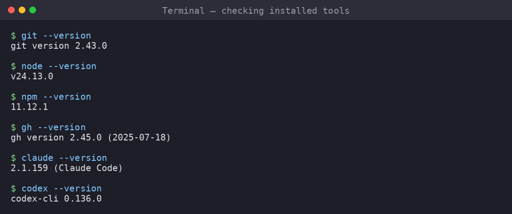

# 01 — Setting Up Your Environment



Before touching any AI agent, your machine needs the basics.

## 1.1 Checklist

Install and verify these tools:

```bash
git --version        # >= 2.40
node --version       # >= 20
npm --version        # comes with Node
gh --version         # GitHub CLI >= 2.40
```

If any are missing, install them first.

## 1.2 Git

Git is mandatory. Every agent we use requires a git repository.

```bash
# Install (Debian/Ubuntu)
sudo apt update && sudo apt install git -y

# Verify
git --version
```

### Configure your identity

```bash
git config --global user.name "Your Name"
git config --global user.email "your.email@university.ac.id"
```

> This identity appears on every commit. Use your real name and university email.

### Screenshot: git identity

```
$ git config --global user.name "Andri Setiawan"
$ git config --global user.email "andri@uii.ac.id"
$ git config --list | grep user
user.name=Andri Setiawan
user.email=andri@uii.ac.id
```

## 1.3 Node.js and npm

Both Claude Code and Codex are Node.js applications.

```bash
# Option A: install via NodeSource (Linux)
curl -fsSL https://deb.nodesource.com/setup_22.x | sudo -E bash -
sudo apt install -y nodejs

# Option B: install via nvm (recommended)
curl -o- https://raw.githubusercontent.com/nvm-sh/nvm/v0.40.0/install.sh | bash
source ~/.bashrc
nvm install 22

# Verify
node --version   # v22.x or v24.x
npm --version    # 10.x or 11.x
```

## 1.4 GitHub CLI (`gh`)

The GitHub CLI lets you create repos, issues, and PRs from the terminal — no
browser needed.

```bash
# Install (Debian/Ubuntu)
sudo apt install gh

# Verify
gh --version
```

### Authenticate

```bash
gh auth login
```

Follow the interactive prompts:

1. Choose **GitHub.com**.
2. Choose **HTTPS**.
3. Choose **Login with a web browser**.
4. Copy the one-time code, press Enter, and authenticate in the browser.

### Verify authentication

```bash
gh auth status
```

### Screenshot: gh auth status

```
$ gh auth status
github.com
  ✓ Logged in to github.com account andri-setiawan
  - Active account: true
  - Git operations protocol: https
  - Token: ghp_************************************
```

> **If you see a green checkmark, you are ready.**

## 1.5 Create a GitHub repository for your project

Every team needs one repository. One team member creates it; others clone it.

```bash
# Create directory
mkdir room-booking-system
cd room-booking-system
git init
git branch -m main

# Create the repo on GitHub
gh repo create room-booking-system \
  --public \
  --description "Campus Room Booking System — CS Project" \
  --source=. \
  --remote=origin
```

### Screenshot: repo creation

```
$ gh repo create room-booking-system --public --source=. --remote=origin
✓ Created repository andri-setiawan/room-booking-system on GitHub
  https://github.com/andri-setiawan/room-booking-system
```

## 1.6 Initial commit

```bash
# Create a minimal README
cat > README.md << 'EOF'
# Campus Room Booking System

> A room booking system for university campus.

## Status

Project specification in progress.
EOF

# Commit and push
git add README.md
git commit -m "docs: initial README"
git push -u origin main
```

### Screenshot: initial push

```
$ git push -u origin main
Enumerating objects: 3, done.
Counting objects: 100% (3/3), done.
Writing objects: 100% (3/3), 261 bytes | 261.00 KiB/s, done.
Total 3 (delta 0), reused 0 (delta 0), pack-reused 0
To https://github.com/andri-setiawan/room-booking-system
 * [new branch]      main -> main
branch 'main' set up to track 'origin/main'.
```

## 1.7 Team: clone the repo

Other team members clone the repository:

```bash
gh repo clone andri-setiawan/room-booking-system
cd room-booking-system
```

## Summary

After this module, every student should have:

- [x] `git` installed and identity configured
- [x] `node` and `npm` installed
- [x] `gh` installed and authenticated
- [x] A GitHub repository (one per team)
- [x] The repo cloned on every team member's machine
