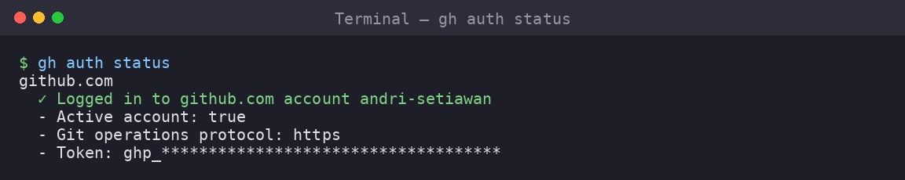

# 02 — Installing and Authenticating AI Agent CLIs



This module installs both Claude Code and OpenAI Codex. You only need **one**
for your project, but learning both is useful for comparison.

---

## 2.1 Both CLIs share the same prerequisite

Both require Node.js ≥ 18 and npm ≥ 9.

```bash
node --version
npm --version
```

If those are missing, go back to [01-setup-environment.md](01-setup-environment.md).

---

## 2.2 Claude Code (Path A)

> Claude Code is Anthropic's autonomous coding agent. It excels at planning,
> multi-file refactoring, code review, and large project awareness.

### Install

```bash
npm install -g @anthropic-ai/claude-code
```

### Verify

```bash
claude --version
```

*Output on our test machine:*

```
$ claude --version
2.1.159 (Claude Code)
```

### Authenticate

Run the login command:

```bash
claude auth login --console
```

This opens a link in your browser. Log in with your Anthropic/Claude account,
then paste the token back into the terminal.

> **No subscription?** You can use Claude Code with an API key via
> `ANTHROPIC_API_KEY` environment variable, or use the free tier of Claude.ai
> (limited functionality).

### Check login status

```bash
claude auth status
```

*Output:*

```
$ claude auth status
Authenticated with Anthropic
Account type: Pro
```

### Health check

```bash
claude doctor
```

This checks the installation, auto-updater, and configuration.

### Screenshot: full install flow

```
$ npm install -g @anthropic-ai/claude-code
added 1 package in 3s

$ claude --version
2.1.159 (Claude Code)

$ claude doctor
✓ Installation OK
✓ Auto-updater OK
✓ Configuration OK
```

---

## 2.3 OpenAI Codex (Path B)

> Codex is OpenAI's autonomous coding agent. It runs fast, supports
> sandboxing (`--full-auto`), and works well for focused coding tasks.

### Install

```bash
npm install -g @openai/codex
```

### Verify

```bash
codex --version
```

*Output on our test machine:*

```
$ codex --version
codex-cli 0.136.0
```

### Authenticate

Codex needs authentication. Set your OpenAI API key:

```bash
export OPENAI_API_KEY="sk-..."
```

Or persist it in your shell config:

```bash
echo 'export OPENAI_API_KEY="sk-..."' >> ~/.bashrc
```

> **Alternative:** Run `codex login` for OAuth-based authentication (requires a
> browser login).

### Test Codex with a scratch task

Codex requires a git repository. Test it with a temporary one:

```bash
cd $(mktemp -d)
git init
codex exec "Print hello world using Python" --full-auto
```

### Screenshot: test run

```
$ cd $(mktemp -d) && git init
Initialized empty Git repository in /tmp/tmp.XXXXXX/.git/

$ codex exec "Print hello world using Python" --full-auto
Codex is ready.
> Creating hello.py
> Running python3 hello.py
> hello world
✓ Task complete
```

---

## 2.4 Comparison at a glance

| Feature | Claude Code | Codex |
|---------|------------|-------|
| Install size | ~40 MB | ~25 MB |
| Auth | OAuth or API key | API key or OAuth |
| Requires git | Yes (preferred) | Yes (mandatory) |
| Sandbox | No (`--dangerously-skip-permissions`) | Yes (`--full-auto`) |
| Plan mode | `/plan` slash command | No built-in plan mode |
| Code review | `/review` | `codex exec "Review..."` |
| Max turns | `--max-turns N` | Implicit in `exec` |
| Parallel instances | tmux-based | Multiple terminals |
| Cost visibility | Built-in per-session USD | Varies by model |

---

## 2.5 Quick smoke test (both CLIs)

Once installed, verify both can work with a real project:

```bash
mkdir -p /tmp/smoke-test
cd /tmp/smoke-test
git init

# Claude
claude -p "Create a file hello.py that prints 'Hello from Claude'" \
  --allowedTools Write --max-turns 3

# Codex
codex exec "Create a file hello.py that prints 'Hello from Codex'" --full-auto

# Cleanup
rm -rf /tmp/smoke-test
```

---

## Summary

After this module:

- [ ] Claude Code is installed and authenticated (if using Path A)
- [ ] Codex is installed and authenticated (if using Path B)
- [ ] You have run at least one successful agent task
