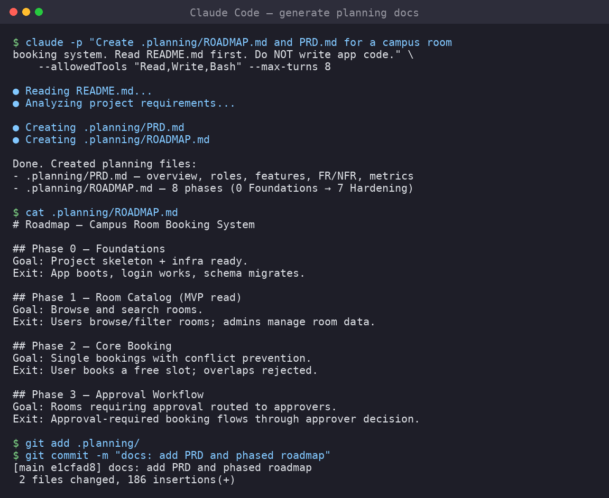

# 03 — The Get Shit Done (GSD) Workflow



The **Get Shit Done** workflow is a structured planning system that turns a raw idea
into a project specification, a product requirements document (PRD), and a phased
roadmap — before a single line of application code is written.

This workflow is used inside Hermes Agent, but the *principles* apply equally to
plain Claude Code or Codex.

---

## 3.1 Why a workflow at all?

When you open Claude Code and type:

```text
Build a room booking system for a university
```

The agent will generate code. That code will probably work. It will also probably:

- miss half the features you needed
- use a tech stack you did not agree on
- be structured in a way that cannot grow
- have no tests
- be impossible to divide among team members

The GSD workflow solves this by creating **checkpoints** before implementation.

---

## 3.2 The planning files

The workflow creates a `.planning/` directory in your repository:

```
.planning/
├── PROJECT.md          ← one-page project summary
├── REQUIREMENTS.md     ← numbered functional and non-functional requirements
├── ROADMAP.md          ← phases with deliverables
└── phases/
    ├── phase-1/
    │   └── PLAN.md     ← detailed task list for one phase
    └── phase-2/
        └── PLAN.md
```

None of these files contain application code. They define **what** and **when**,
not **how**.

---

## 3.3 The workflow step by step

```
Step 1 — Write PROJECT_SPEC.md     (human, 15–30 min)
Step 2 — Generate PROJECT.md       (agent)
Step 3 — Generate PRD.md           (agent + human review)
Step 4 — Generate REQUIREMENTS.md  (agent + human review)
Step 5 — Generate ROADMAP.md       (agent + human review)
Step 6 — Generate PLAN.md for Phase 1   (agent)
Step 7 — Implement Phase 1         (agent)
Step 8 — Verify + tests             (agent + human)
Step 9 — Pull Request + review      (human)
Step 10 — Merge → start Phase 2
```

> **Rule:** steps 6–10 repeat for every phase. Steps 1–5 happen once per project.

---

## 3.4 Using GSD inside Hermes Agent

If you are running Hermes Agent with the GSD plugin installed, the commands are:

```text
/gsd-new-project        → guided questions, creates .planning/
/gsd-plan-phase 1       → creates .planning/phases/phase-1/PLAN.md
/gsd-execute-phase 1    → agent runs tasks in the plan
/gsd-verify-work        → agent checks output against requirements
/gsd-ship               → creates PR, triggers review
```

These slash commands produce the planning files automatically.

---

## 3.5 Using the equivalent workflow with plain Claude Code or Codex

If you are using Claude Code or Codex **without** the Hermes GSD plugin, use these
prompt equivalents.

### Step A: Initialize planning from a spec

```bash
claude -p "
Read PROJECT_SPEC.md.
You are running a specification-first software development workflow.

Your tasks (do ALL of them, do not write app code yet):
1. Create .planning/PROJECT.md — one-page project summary.
2. Create .planning/REQUIREMENTS.md — numbered requirements, two sections:
   functional and non-functional.
3. Create .planning/ROADMAP.md — split the project into phases of 3-5 features
   each. MVP first. Each phase must have a clear deliverable.
4. Ask questions about anything unclear before creating these files.

Stop after creating these three planning files.
" --max-turns 20
```

```bash
# Codex equivalent
codex exec --full-auto "
Read PROJECT_SPEC.md.
Create .planning/PROJECT.md, .planning/REQUIREMENTS.md, and .planning/ROADMAP.md.
Do not write app code yet. Use spec-first principles.
"
```

### Step B: Plan a phase

```bash
claude -p "
Read .planning/ROADMAP.md.
Create .planning/phases/phase-1/PLAN.md.
The plan must contain:
- Phase goal
- Acceptance criteria
- List of implementation tasks (each task = one atomic file/function change)
- Test strategy
Do not write app code yet.
" --max-turns 10
```

### Step C: Execute a phase

```bash
claude -p "
Read .planning/phases/phase-1/PLAN.md and .planning/REQUIREMENTS.md.
Implement all tasks in the Phase 1 plan.
Run tests after each task.
Stop after Phase 1 is complete. Do not start Phase 2.
Commit changes with conventional commit messages.
" --max-turns 25
```

---

## 3.6 Example: planning directory after setup

```
.planning/
├── PROJECT.md
│     ─ Project name, problem, users, constraints, success criteria
├── REQUIREMENTS.md
│     ─ F01: Users can register with email and password
│     ─ F02: Users can log in
│     ─ F03: Users can view available rooms
│     ─ NF01: All pages must load in < 2 seconds
│     ─ NF02: App must run on Chrome 120+
├── ROADMAP.md
│     ─ Phase 1: Auth (register, login, logout)
│     ─ Phase 2: Room listing (view rooms, availability)
│     ─ Phase 3: Booking (create, view, cancel)
│     ─ Phase 4: Admin approval (dashboard, accept/reject)
│     ─ Phase 5: Notifications + deployment
└── phases/
    └── phase-1/
        └── PLAN.md
              ─ Task 1.1: Create user model + migration
              ─ Task 1.2: POST /auth/register endpoint
              ─ Task 1.3: POST /auth/login endpoint
              ─ Task 1.4: GET /auth/logout
              ─ Task 1.5: Frontend login/register form
              ─ Task 1.6: Tests for all auth endpoints
```

---

## 3.7 Key principles

| Principle | Description |
|-----------|-------------|
| **Planning before code** | `.planning/` files are created and reviewed before any feature code |
| **One phase at a time** | Never ask the agent to implement multiple phases at once |
| **Atomic tasks** | Each task in PLAN.md should touch ≤ 3 files |
| **Tests are part of the phase** | Tests are in the PLAN.md, not an afterthought |
| **Human approval gates** | After generating PRD, ROADMAP, and each PLAN.md, a human reviews before proceeding |

---

## Summary

After this module, students understand:

- [ ] Why a planning workflow prevents specification drift
- [ ] What files live in `.planning/`
- [ ] How to prompt an agent to create planning documents
- [ ] How to prompt an agent to implement one phase at a time
