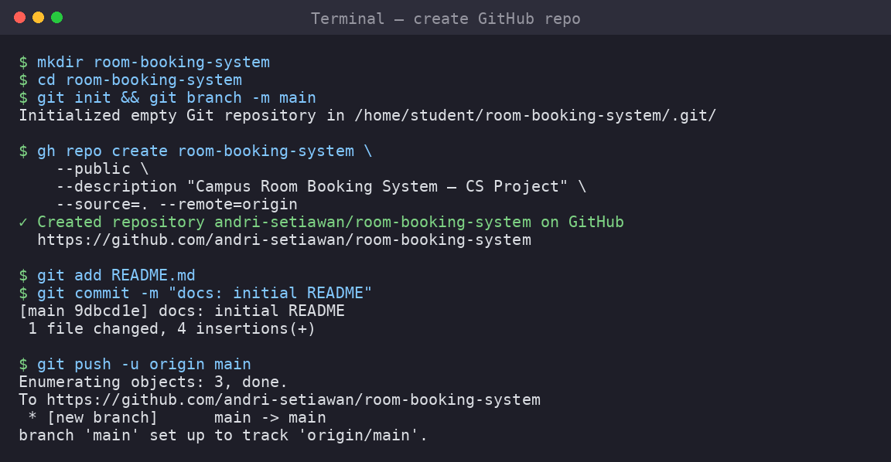

# 07 — GitHub Workflow: Issues, Branches, Commits, and Pull Requests



GitHub is where team collaboration becomes visible and reviewable. AI agents can
write code, but GitHub records what changed, why it changed, and who approved it.

> **Rule:** nobody commits directly to `main` after the initial setup. Every
> feature goes through a branch and a Pull Request.

---

## 7.1 Recommended repository structure

```
room-booking-system/
├── README.md
├── PROJECT_SPEC.md
├── PRD.md
├── CLAUDE.md              # project instructions for Claude Code
├── AGENTS.md              # project instructions for Codex / other agents
├── .planning/
│   ├── PROJECT.md
│   ├── REQUIREMENTS.md
│   └── ROADMAP.md
├── docs/
│   └── adr/
│       └── 0001-tech-stack.md
├── backend/
└── frontend/
```

---

## 7.2 Create issues from the roadmap

Each roadmap phase becomes several GitHub issues. Example:

```bash
gh issue create \
  --title "Phase 1: Implement user authentication" \
  --body "Implement registration, login, logout, JWT/session handling, and tests. See .planning/ROADMAP.md Phase 1." \
  --label "phase-1,feature"
```

Create smaller issues:

```bash
gh issue create --title "Auth: create user model" --label "phase-1,backend"
gh issue create --title "Auth: register endpoint" --label "phase-1,backend"
gh issue create --title "Auth: login page" --label "phase-1,frontend"
gh issue create --title "Auth: backend tests" --label "phase-1,test"
```

### Screenshot: issue list

```
$ gh issue list

#4  Auth: backend tests           open  phase-1,test
#3  Auth: login page              open  phase-1,frontend
#2  Auth: register endpoint       open  phase-1,backend
#1  Phase 1: Implement user authentication  open  phase-1,feature
```

---

## 7.3 Branch naming convention

Use predictable branch names:

```text
feat/auth
feat/room-listing
feat/booking-request
feat/admin-approval
fix/login-validation
 docs/update-prd
```

Recommended pattern:

```bash
git checkout main
git pull origin main
git checkout -b feat/auth
```

---

## 7.4 Commit convention

Use Conventional Commits:

```text
feat: add login endpoint
fix: prevent overlapping room bookings
test: add auth endpoint tests
docs: update PRD permission matrix
refactor: extract booking conflict checker
```

A good commit message:

```bash
git commit -m "feat: add user registration endpoint"
```

A bad commit message:

```bash
git commit -m "update"
```

---

## 7.5 Create a Pull Request

After changes are committed:

```bash
git push -u origin feat/auth

gh pr create \
  --title "feat: add authentication" \
  --body-file .github/PULL_REQUEST_TEMPLATE.md
```

Or write the body manually:

```bash
gh pr create \
  --title "feat: add authentication" \
  --body "
## Summary
- Adds user registration
- Adds login/logout
- Adds backend tests

## Linked Issue
Closes #1

## Test Evidence
- pytest: passed
- npm test: passed

## Screenshots
- Login page screenshot attached
"
```

### Screenshot: PR creation

```
$ gh pr create --title "feat: add authentication" --body-file .github/PULL_REQUEST_TEMPLATE.md

Creating pull request for feat/auth into main in andri-setiawan/room-booking-system

https://github.com/andri-setiawan/room-booking-system/pull/5
```

---

## 7.6 Protect `main`

For class projects, branch protection is strongly recommended.

In GitHub UI:

1. Repository → Settings
2. Branches
3. Add branch protection rule
4. Branch name pattern: `main`
5. Enable:
   - Require a pull request before merging
   - Require approvals: 1
   - Require status checks to pass (if CI exists)

CLI/API setup varies by repository permissions, so UI is easier for students.

---

## 7.7 PR review checklist

Every PR must answer:

```text
[ ] Does this match PRD.md?
[ ] Does this implement only the intended phase/issue?
[ ] Are there tests?
[ ] Were tests actually run?
[ ] Are there screenshots for UI changes?
[ ] Are there secrets or credentials accidentally committed?
[ ] Is the code readable enough for another team member?
```

---

## 7.8 AI-generated code must still be reviewed

If the AI wrote the code, the PR description should say so:

```markdown
## AI Assistance
This PR was implemented with Claude Code / Codex.
Human reviewer checked:
- requirements alignment
- test results
- security-sensitive code
- unexpected files
```

This is not shameful. It is transparent engineering.

---

## Summary

After this module, each team knows how to:

- [ ] Create issues from the roadmap
- [ ] Use feature branches
- [ ] Write meaningful commits
- [ ] Open Pull Requests
- [ ] Review PRs before merging
