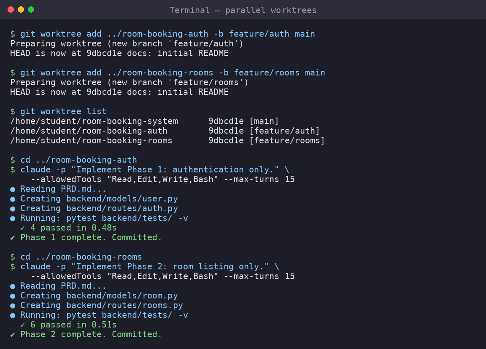

# 08 — Team Collaboration with Git Worktrees



When multiple team members (or AI agents) work simultaneously, a single working
directory with one branch at a time creates bottlenecks. **Git worktrees** solve
this by letting you check out different branches in separate directories, all
sharing the same repository storage.

---

## 8.1 The problem

```
Team of 4 people, one repo, one directory:

Student A: working on auth    → needs feature/auth branch
Student B: working on rooms   → needs feature/rooms branch
Student C: working on booking → needs feature/booking branch
Student D: working on UI      → needs feature/ui branch

Without worktrees: they must stash / switch / conflict constantly.
With worktrees: each has their own directory, their own branch, their own node_modules.
```

---

## 8.2 What a worktree is

A worktree is a **separate working directory** that shares the same `.git` object
database. A commit in worktree A is instantly visible in worktree B (no pushing
or fetching needed).

```text
room-booking-system/               main branch
├── .git/                           ← shared object store
├── backend/
├── frontend/

room-booking-auth/                  feature/auth branch
├── .git  → linked to parent
├── backend/
├── frontend/

room-booking-booking/               feature/booking branch
├── .git  → linked to parent
├── backend/
├── frontend/
```

---

## 8.3 Creating worktrees

```bash
# From the main repo
cd room-booking-system

git worktree add ../room-booking-auth -b feature/auth main
git worktree add ../room-booking-rooms -b feature/rooms main
git worktree add ../room-booking-booking -b feature/booking main
git worktree add ../room-booking-ui -b feature/ui main
```

### Screenshot: creating worktrees

```
$ git worktree add ../room-booking-auth -b feature/auth main
Preparing worktree (new branch 'feature/auth')
HEAD is now at a1b2c3d docs: initial README

$ git worktree add ../room-booking-rooms -b feature/rooms main
Preparing worktree (new branch 'feature/rooms')
HEAD is now at a1b2c3d docs: initial README

$ git worktree list
/home/student/room-booking-system         a1b2c3d [main]
/home/student/room-booking-auth           a1b2c3d [feature/auth]
/home/student/room-booking-rooms          a1b2c3d [feature/rooms]
/home/student/room-booking-booking        a1b2c3d [feature/booking]
/home/student/room-booking-ui             a1b2c3d [feature/ui]
```

> **Warning:** `git worktree add` creates a **hard link** to the original `.git`.
> Place it alongside the original directory. Do NOT put it inside the original repo.

---

## 8.4 Team assignment

| Person / Agent | Directory | Branch | Feature |
|----------------|-----------|--------|---------|
| Student A | `room-booking-auth` | `feature/auth` | Registration, login, logout |
| Student B | `room-booking-rooms` | `feature/rooms` | Room CRUD, availability |
| Student C | `room-booking-booking` | `feature/booking` | Booking request + history |
| Student D | `room-booking-ui` | `feature/ui` | Shared UI components |

---

## 8.5 AI agents in separate worktrees

Each AI agent runs in its own worktree with its own scope.

### Claude Code in a worktree

```bash
# Student A asks Claude to implement auth
cd ../room-booking-auth

claude -p "
Read PRD.md and .planning/ROADMAP.md.
This worktree is for Phase 1: Authentication only.
Do not touch room or booking modules.

Implement:
1. User model with SQLAlchemy
2. POST /auth/register
3. POST /auth/login
4. GET /auth/me
5. Frontend login and register pages
6. Backend tests for all endpoints
Commit changes with conventional commit messages.
" --allowedTools "Read,Edit,Write,Bash" --max-turns 20
```

### Codex in a worktree

```bash
cd ../room-booking-rooms

codex exec --full-auto "
Read PRD.md and .planning/ROADMAP.md.
This worktree is for Phase 2: Room Listing only.
Do not touch auth or booking modules.

Implement:
1. Room model
2. GET /rooms endpoint
3. GET /rooms/:id endpoint
4. Frontend room listing page
5. Tests
Commit changes with conventional commit messages.
"
```

---

## 8.6 Advantages of worktrees for team + AI

1. **Isolation:** Each agent or student works without seeing other branches.
2. **Parallel runs:** Claude and Codex running simultaneously is fine.
3. **Shared object store:** `git log` sees everything. Merging is easy.
4. **No stash circus:** Keep main-wt, auth-wt, room-wt open simultaneously.
5. **Independent `npm install`:** Each worktree has its own `node_modules`.

---

## 8.7 Pushing and creating PRs from worktrees

```bash
# From auth worktree
cd ../room-booking-auth
git push -u origin feature/auth
gh pr create --title "feat: add authentication" --body "Closes #1"

# From rooms worktree
cd ../room-booking-rooms
git push -u origin feature/rooms
gh pr create --title "feat: add room listing" --body "Closes #2"
```

---

## 8.8 Merging worktrees

After a PR is merged, update all worktrees:

```bash
# In each worktree
cd ../room-booking-auth
git checkout main
git pull origin main

# Then create a new branch for the next phase
git checkout -b feat/user-profile
```

---

## 8.9 Cleaning up stale worktrees

```bash
# List all worktrees
git worktree list

# Remove a worktree (after its branch is merged)
git worktree remove ../room-booking-auth
git branch -d feature/auth    # also safe: git push origin --delete feature/auth

# Prune orphaned worktree records
git worktree prune
```

---

## 8.10 Alternative: Claude Code built-in worktrees

Claude Code has a built-in `--worktree` flag:

```bash
claude -w feat/auth --tmux
```

This creates `.claude/worktrees/feat/auth` and opens a tmux session automatically.
It works well for single-agent use but less visible for team coordination.

---

## 8.11 Worktree diagram for team communication

```text
┌─────────────────────────────────────────────────────────────┐
│                   GitHub repo (main)                        │
│   https://github.com/andri-setiawan/room-booking-system     │
└──────────────────────┬──────────────────────────────────────┘
                       │
          ┌────────────┼────────────┬──────────────┐
          ▼            ▼            ▼              ▼
    ┌──────────┐ ┌──────────┐ ┌──────────┐ ┌──────────┐
    │ Auth     │ │ Rooms    │ │ Booking  │ │ UI       │
    │ worktree │ │ worktree │ │ worktree │ │ worktree │
    │          │ │          │ │          │ │          │
    │ Student  │ │ Student  │ │ Student  │ │ Student  │
    │ A        │ │ B        │ │ C        │ │ D        │
    │          │ │          │ │          │ │          │
    │ Claude   │ │ Codex    │ │ Claude   │ │ Editor   │
    └──────────┘ └──────────┘ └──────────┘ └──────────┘
         │             │            │             │
         └──────┬──────┘            └──────┬──────┘
                ▼                          ▼
          ┌──────────┐              ┌──────────┐
          │ PR #1:   │              │ PR #2:   │
          │ feat/auth│              │feat/rooms│
          └──────────┘              └──────────┘
                │                        │
                └─────────┬──────────────┘
                          ▼
                  ┌──────────────┐
                  │    merge     │
                  │  into main   │
                  └──────────────┘
```

---

## Summary

After this module, teams can:

- [ ] Create isolated worktrees for each feature branch
- [ ] Assign one worktree per team member / AI agent
- [ ] Develop in parallel without conflicts
- [ ] Push each worktree as its own PR
- [ ] Clean up worktrees after merge
