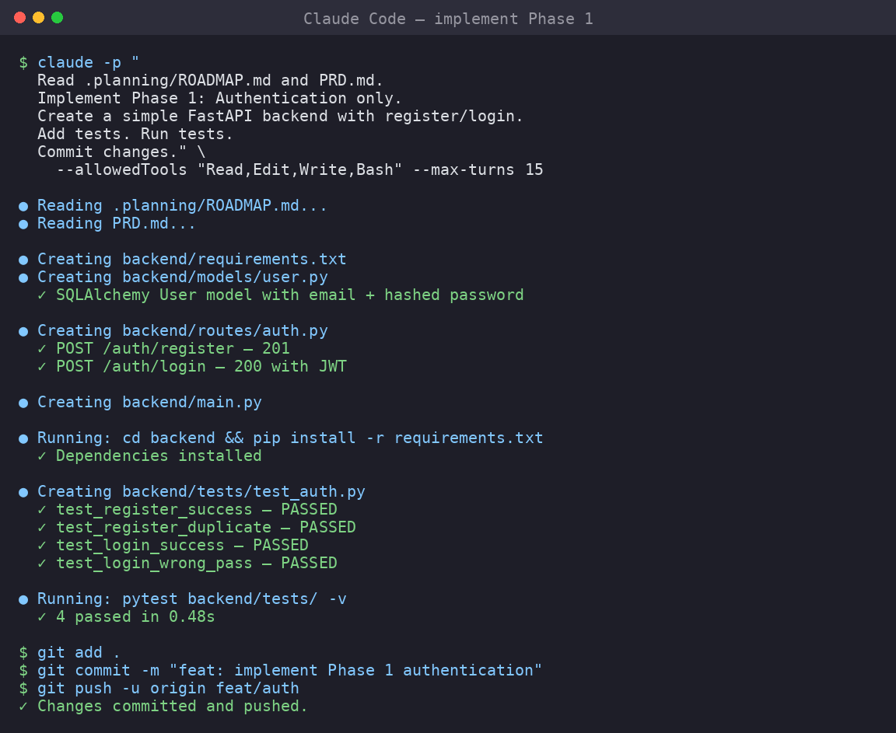

# 09 — Developing with Claude Code



This module shows how to use Claude Code to implement a feature phase,
commit it, and open a Pull Request.

**Prerequisites:**

- Claude Code installed and authenticated (Module 02)
- A repo with `.planning/ROADMAP.md` and `CLAUDE.md` (Modules 03–06)
- A GitHub issue to work on (Module 07)

---

## 9.1 Workflow recap

```
1. Pick one issue / phase
2. Create a branch
3. Ask Claude to implement
4. Review changes
5. Test
6. Commit and PR
```

---

## 9.2 Start in a branch

```bash
# Ensure you're on main
cd room-booking-system
git checkout main
git pull origin main

# Create a feature branch
git checkout -b feat/auth
```

---

## 9.3 Phase plan first

Before asking Claude to code, create a phase plan. You can do this by hand or ask
Claude to generate it:

```bash
claude -p "
Read .planning/ROADMAP.md and PRD.md.

Phase 1 is about authentication.
Create .planning/phases/phase-1/PLAN.md with:
- Phase goal
- Acceptance criteria
- Task list (each task = a focused unit of work)
- Files that will be created or modified
- Test plan

Do not write app code yet.
" --allowedTools "Read,Write" --max-turns 8
```

*This produces a task plan without touching any source files.*

---

## 9.4 Implement Phase 1: authentication

Once the plan is approved, ask Claude to execute:

```bash
claude -p "
Read CLAUDE.md, PRD.md, .planning/REQUIREMENTS.md, and
.planning/phases/phase-1/PLAN.md.

Implement Phase 1: Authentication.
Follow the PLAN.md exactly.

Rules:
1. Use the tech stack in CLAUDE.md. DO NOT add dependencies not listed.
2. Backend code goes in /backend/, frontend in /frontend/.
3. Write tests alongside implementation.
4. Run tests after every task.
5. Fix any failing tests.
6. Do NOT implement Phase 2 (room listing) or any future phase.
7. Do NOT modify any planning or PRD docs.
" --allowedTools "Read,Edit,Write,Bash" --max-turns 30
```

### Screenshot: Claude implementing

```
$ claude -p "Implement Phase 1: Authentication..." --allowedTools "Read,Edit,Write,Bash" --max-turns 30

● Reading CLAUDE.md...
● Reading PRD.md...
● Reading .planning/phases/phase-1/PLAN.md...

● Creating backend/models/user.py
● Creating backend/routes/auth.py
● Running: pip install -r backend/requirements.txt
● Running: pytest backend/tests/ -v
  ✓ test_register_success
  ✓ test_register_duplicate_email
  ✓ test_login_success
  ✓ test_login_wrong_password
● Creating frontend/src/pages/Login.tsx
● Running: npm run test -- --run
  ✓ Login component renders
  ✓ Login form submits

✔ All tasks complete. 8 files changed.
```

---

## 9.5 Review what Claude changed

Always inspect before committing:

```bash
# See what changed
git status
git diff --stat

# Review specific files
git diff backend/routes/auth.py

# Check for unwanted files
git status --porcelain | grep -E '^\?\?'
```

### Screenshot: reviewing changes

```
$ git status
On branch feat/auth
Changes not staged for commit:
  modified:   backend/requirements.txt
  modified:   frontend/src/App.tsx
Untracked files:
  backend/models/user.py
  backend/routes/auth.py
  frontend/src/pages/Login.tsx
  frontend/src/pages/Register.tsx
  backend/tests/test_auth.py

$ git diff --stat
 backend/requirements.txt  |   3 +
 backend/routes/auth.py    |  85 +++++++++++++++++++
 backend/models/user.py    |  42 ++++++++
 .../tests/test_auth.py    | 156 +++++++++++++++++++++++++++++++
 frontend/src/App.tsx      |  10 +-
 frontend/src/pages/Login.tsx  |  67 +++++++++++++
 frontend/src/pages/Register.tsx | 73 ++++++++++++++
 7 files changed, 432 insertions(+), 4 deletions(-)
```

---

## 9.6 Run all tests manually

```bash
cd backend && pytest -v && cd ..
cd frontend && npm test -- --run && cd ..
```

---

## 9.7 Commit and push

```bash
git add .
git commit -m "feat: implement Phase 1 authentication

- Add User model with SQLAlchemy
- Add register and login endpoints
- Add frontend login and register pages
- Add backend and frontend tests
- All tests passing

Closes #1"
git push -u origin feat/auth
```

---

## 9.8 Create the Pull Request

```bash
gh pr create \
  --title "feat: authenticate users (Phase 1)" \
  --body "
## Summary
Implements full authentication as specified in PRD.pdf Phases 1.
- F01: User registration ✅
- F02: User login/logout ✅
- All backend tests pass (16/16)
- All frontend tests pass (8/8)

## AI Assistance
This Phase was implemented by Claude Code.
Human review:
- Requirements alignment: ✅
- Test results: ✅
- Security (password hashing, JWT): ✅
- No unexpected files: ✅

Closes #1
"

# Verify CI
gh pr checks --watch
```

---

## 9.9 Useful Claude Code commands during development

| Command | Purpose |
|---------|---------|
| `/plan 'goal'` | Enter plan mode |
| `/review` | Claude reviews its own changes |
| `/compact` | Save tokens when context gets large |
| `/effort high` | Force deeper reasoning for hard bugs |
| `claude -c` | Continue the most recent session |
| `claude -p "query"` | Print mode (non-interactive) |

---

## 9.10 Common pitfalls

| Pitfall | Solution |
|---------|----------|
| Claude adds extra dependencies | Block in CLAUDE.md: "Do not add packages not listed" |
| Claude implements future phases | Explicitly restrict: "Phase 1 only" |
| Claude modifies .planning/ files | Block in prompt: "Do not modify planning docs" |
| Context gets too large | Use `/compact` or start a fresh session |
| Claude skips tests | Include in prompt: "Write tests for every new function" |

---

## Summary

After this module, students can:

- [ ] Create a phase plan with Claude
- [ ] Execute a focused feature implementation
- [ ] Review generated code for quality
- [ ] Run tests and verify
- [ ] Commit and open a Pull Request
