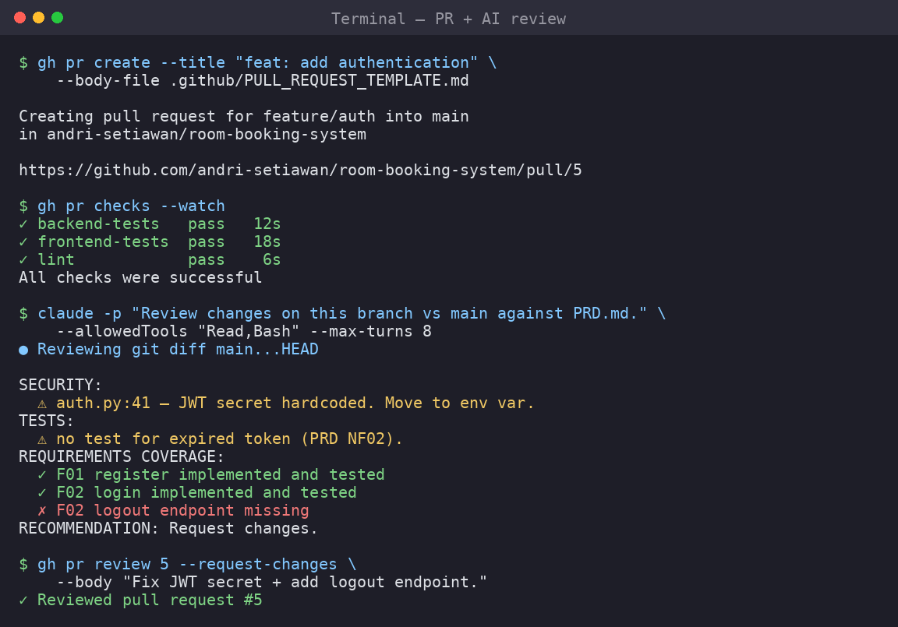

# 11 — Reviewing AI-Written Code Before Merging



AI agents write a lot of code quickly. The Pull Request review is where the team
ensures that code is correct, secure, and actually solves the problem in the PRD.

> **Rule:** No AI-generated PR is merged without at least one human review.

---

## 11.1 Why review AI code at all?

AI agents can:

- implement features that look right but miss edge cases
- introduce subtle security bugs (e.g. no rate limiting, weak hashing)
- add unnecessary dependencies
- write tests that pass but don't actually test the requirement
- "hallucinate" requirements that were never in the PRD

The reviewer's job is to catch these before they reach `main`.

---

## 11.2 The two-layer review

```
Layer 1: AI-assisted review   → fast, catches obvious issues
Layer 2: Human review         → judgment, security, requirements
```

Use the AI to do the first pass, then a human makes the final call.

---

## 11.3 Layer 1 — AI-assisted review

### Using Claude Code

```bash
# Check out the PR branch
gh pr checkout 5

# Ask Claude to review against the PRD
claude -p "
Read PRD.md and .planning/REQUIREMENTS.md.
Then review the changes on this branch versus main:
git diff main...HEAD

Report:
1. Bugs or logic errors
2. Security issues (auth, input validation, secrets, SQL injection)
3. Missing tests or tests that don't test the requirement
4. Features implemented that are NOT in the PRD (scope creep)
5. Requirements from PRD that are NOT implemented

Be specific. Reference file names and line numbers.
Do NOT change any code — review only.
" --allowedTools "Read,Bash" --max-turns 8
```

### Using Codex

```bash
gh pr checkout 5

codex exec "
Review the current branch against main.
git diff main...origin/main
Identify: bugs, security issues, missing tests, and any mismatch with PRD.md.
Do not modify code. Output a review report.
"
```

### Screenshot: AI review output

```
$ claude -p "Review the changes..." --allowedTools "Read,Bash" --max-turns 8

● Reviewing git diff main...HEAD

SECURITY:
  ⚠ backend/routes/auth.py:23 — password compared with == instead of
    constant-time compare. Use passlib's verify().
  ⚠ backend/routes/auth.py:41 — JWT secret is hardcoded. Move to env var.

TESTS:
  ⚠ test_auth.py — no test for expired token. PRD NF02 implies sessions expire.

SCOPE:
  ✓ No features outside PRD found.

REQUIREMENTS COVERAGE:
  ✓ F01 (register) implemented and tested
  ✓ F02 (login) implemented and tested
  ✗ F02 logout endpoint missing

RECOMMENDATION: Request changes — fix JWT secret and add logout + token tests.
```

---

## 11.4 Layer 2 — Human review checklist

Even after AI review, a human checks:

```text
REQUIREMENTS
[ ] Does this match the PRD?
[ ] Does it implement ONLY the intended issue/phase?
[ ] Are all acceptance criteria met?

CORRECTNESS
[ ] Did I read the actual diff (not just the description)?
[ ] Do the tests actually test the requirement?
[ ] Did I run the app and try the feature myself?

SECURITY
[ ] No hardcoded secrets / API keys / passwords
[ ] Passwords hashed (never plain text)
[ ] Input validated on the server, not just the client
[ ] No SQL string concatenation (use ORM / parameters)

QUALITY
[ ] Code is readable by another student
[ ] No unrelated files changed
[ ] No giant commented-out blocks
[ ] No new dependencies without team approval

PROCESS
[ ] Tests run and pass (I saw the output, not just trust)
[ ] Screenshots attached for UI changes
[ ] PR description is honest about AI assistance
```

---

## 11.5 Leaving review comments on a PR

```bash
# General comment
gh pr comment 5 --body "JWT secret is hardcoded in auth.py:41 — please move to an env variable before merge."

# Request changes (via web UI is easiest, but CLI works)
gh pr review 5 --request-changes --body "Fix the security issues from the AI review first."

# Approve when fixed
gh pr review 5 --approve --body "Security issues resolved, tests pass, matches PRD. LGTM."
```

---

## 11.6 The fix loop

```
1. Reviewer requests changes
2. Author asks AI to fix the specific issues:

   claude -p "
   The PR review found these issues:
   1. JWT secret hardcoded in backend/routes/auth.py:41 — move to env var.
   2. Logout endpoint missing — add GET /auth/logout.
   3. No test for expired token — add one.
   Fix exactly these three issues. Do not change anything else.
   " --allowedTools "Read,Edit,Write,Bash" --max-turns 10

3. Author pushes the fix:  git add . && git commit -m "fix: address review" && git push
4. Reviewer re-checks and approves
```

---

## 11.7 Merging

Once approved and CI is green:

```bash
gh pr merge 5 --squash --delete-branch
```

### Screenshot: merge

```
$ gh pr merge 5 --squash --delete-branch
✓ Squashed and merged pull request #5 (feat: authenticate users)
✓ Deleted branch feat/auth
```

Then everyone updates main:

```bash
git checkout main
git pull origin main
```

---

## 11.8 Teaching point: trust but verify

The single most important habit for students using AI:

> **Never merge code you have not read and tested, no matter how confident the
> AI sounds.**

The AI's summary ("All tests pass, feature complete") is a *claim*, not proof.
The reviewer's job is to verify the claim.

---

## Summary

After this module, teams can:

- [ ] Run an AI-assisted first-pass review
- [ ] Apply a human review checklist
- [ ] Leave review comments and request changes
- [ ] Run the fix loop
- [ ] Merge only verified, approved code

---

## 🎓 You finished the tutorial

You now know how to build software with agentic AI **the disciplined way**:

```
spec → PRD → roadmap → tech stack → GitHub → worktrees → AI development → review → merge
```

Go build something — specification first.
